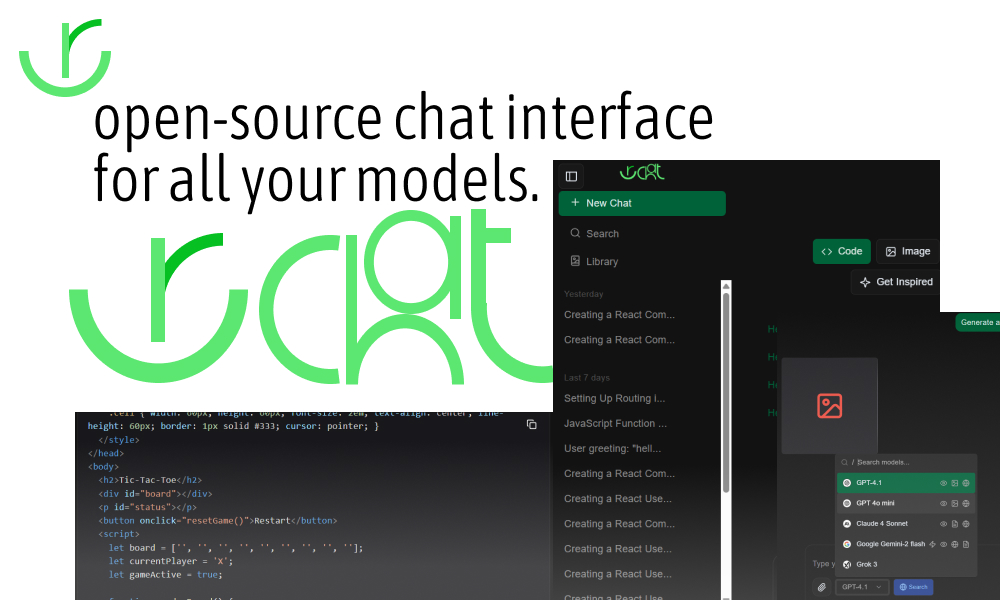

# 🌱 UrChat

[urchato.vercel.app](https://urchato.vercel.app)



**UrChat** is an open-source, self-hostable AI chat platform inspired by modern AI assistants like ChatGPT. It features multi-model support, speech, image generation, and file handling — all within a beautiful, customizable UI.

---

## ✨ Features

- 🧠 **Multi-chat threads** with support for multiple AI models
- 🎤 **Speech-to-text (STT)** and **Text-to-speech (TTS)**
- 🖼️ **Image generation** via prompt
- 📁 **File upload and management** with S3
- ▶️ Stream (WIP)
- 🌓 Light, dark, and **tweakcn** themes
- 🔐 BYOK (Bring Your Own Key) via OpenRouter (WIP)
- 🌐 **Share or fork chats** with public links
- 📚 Chat library and generated file reuse
- 🧩 Customizable: layouts, system prompts, user themes
- 🚀 Built with **Next.js 15**, **Tailwind CSS**, and **shadcn/ui**

---

## ⚡ Quick Start

### 1. Clone the Repository

```bash
git clone https://github.com/your-username/urchat.git
cd urchat
```

### 2. Install Dependencies

```bash
pnpm install
# or
npm install
```

### 3. Configure Environment Variables

Copy `.env.example` to `.env.local` and fill in the required values:

```env
# Auth
BETTER_AUTH_SECRET=
GOOGLE_CLIENT_ID=
GOOGLE_CLIENT_SECRET=
NEXT_PUBLIC_APP_URL=
BETTER_AUTH_URL=

# S3 Storage
S3_STORAGE_URL=
S3_ENDPOINT=
S3_BUCKET_NAME=
S3_ACCESS_KEY=
S3_SECRET_KEY=

# Database
DATABASE_URL=

# Redis (Upstash)
REDIS_URL=
REDIS_SECRET=

# AI Providers
OPENAI_API_KEY=
OPENROUTER_API_KEY=

# Encryption
ENCRYPTION_KEY=
```

> 💡 Don't forget to keep your `.env.local` file private!

### 4. Run the Development Server

pnpm dev

# or

npm run dev

## 🧰 Tech Stack

UrChat is built using a modern, performant stack:

- **Next.js 15** – App Router, Server Actions
- **Tailwind CSS + shadcn/ui** – Styling and component primitives
- **Drizzle ORM** – PostgreSQL migrations and queries
- **better-auth** – Authentication with Google support
- **AI SDK** – Model integration (OpenAI, XAI, OpenRouter)

---

## 🤖 Model Support

UrChat supports the following model providers:

- OpenAI (`gpt-4`, `gpt-3.5`)
- XAI (`grok`)
- OpenRouter (BYOK)
- Local models via Ollama (coming soon)

---

## 🗂️ File Management & Library

Uploaded and generated files are stored in your S3-compatible storage and displayed within a library interface. Users can browse, reuse, and manage content efficiently.

---

## 🔗 Share & Fork

Every conversation in UrChat can be **forked or shared** (WIP). This enables collaboration, showcasing prompts, or public threads.

---

## 🛡️ Authentication & Security

- Powered by **better-auth**
- Supports Google OAuth
- Sessions are securely encrypted with `ENCRYPTION_KEY`
- Rate-limited with **Upstash Redis**

---

## 📜 License

This project is licensed under the [MIT License](./LICENSE).

---

## 🤝 Contributing

We welcome contributions! If you’d like to add features, fix bugs, or improve documentation, feel free to open a PR or issue.
